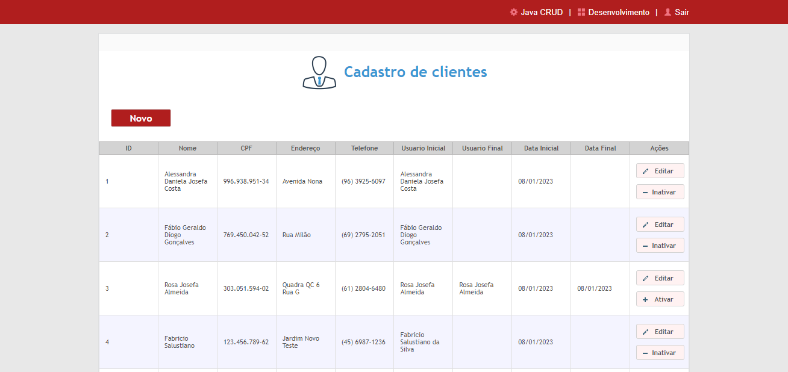
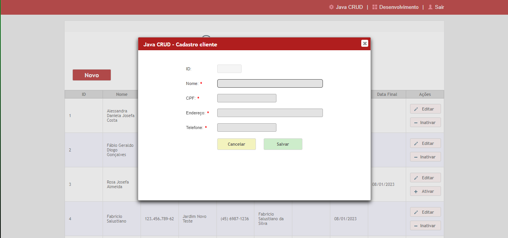
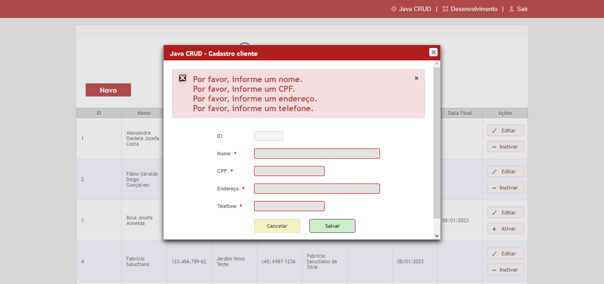
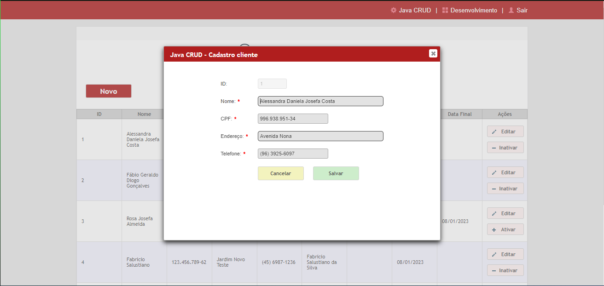
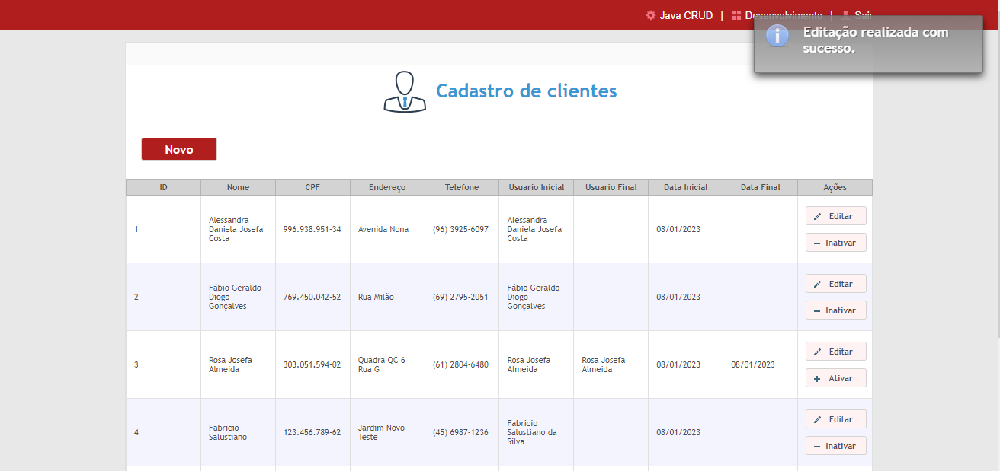

# Java - JavaCrud
Projeto CRUD para treinamento e aperfeiçoamento das tecnologias JSF, Primefaces, JPA e SQL.

O projeto foi desenvolvimento utilizando o padrão de projeto MVC:

- Model - Classes que serão nossas entidades no banco de dados e representaram os objetos principais do sistema.
- View - Telas do sistema.
- Controller - Classes que auxiliam na ligação das telas com o backend do projeto.

Para o frontend foram utilizados os frameworks Java JFS e Primefaces, que nos garante mais agilidade devido aos seus componentes já criados e de fácil manipulação.

Persistindo os dados temos o JPA Hibernate mapeando a classe model "TbCliente" e persistindo a mesma no banco de dados através dos objetos criados pelo JavaBean "ClienteBean" e a conexão configurada no arquivo persistence.xml. Utilizando o banco de dados postgresql 9.3 para todas as operações de banco.

## Tela Inicial

Na tela principal do projeto encontramos uma tabela carregando todos os registros que ja estão salvos no banco de dados. Também temos a possibilidade de cadastrar um novo registro através do botão "novo", editar um registro já existente no botão "Editar" e realizar a exclusão lógica onde será informado no seu registro respectivo o usuário final e a data final do cliente.

## Tela Botão "Novo"

Ao clicar em "Novo" é aberto um modal para que seja inseridas as informações do cliente que deseja cadastrar. Todos os campos passam por uma validação que informa em caso de não preenchimento.

## Tela Botão "Editar"

Na edição de cliente, o modal é carregado com as informações do cliente selecionado, permitindo a edição das informações do mesmo. Os campos aqui também passam por validações que impedem o não preenchimento dos campos.

## Mensagem de sucesso

Ao final das operações, em caso de sucesso é emitida a mensagem de concluída a operação, informando ao usuário que sua operação foi finalizada com sucesso. Esta mensagem tem o tempo de 5 segundos, onde após o tempo é desabilitada automaticamente.
